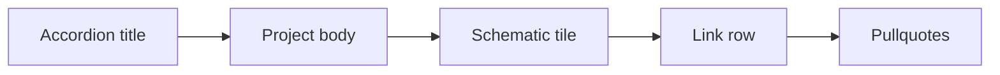

# Accordion schematic tiles

## Abstraction (from first principles)

Per [Yang & Fan 2021](https://arxiv.org/abs/2106.02775): **label-cued category drawings** (~10 strokes) beat photo-exemplar detail for instant recognition. Each accordion gets one **diagnostic schematic** — not a screenshot, not an icon set.

**Tile system** (cohesive with [DESIGN.md](DESIGN.md)):

- Fixed tile: ~`7rem × 4.5rem`,` 4px` radius, eggshell fill, no card shadow
- Stroke: `2px` ink (`#1d1d1f`), rounded caps — a touch heavier than `.home__disclosure` so schematics read clearly at tile size
- **One rose accent** (`#c08081`) on the category-diagnostic element only
- Placement: top of `.home__project-body`, above link row; inline SVG component `AccordionSchematic`
- Data: `schematic: "admissions-agent" | …` on each entry in [content/portfolio.ts](content/portfolio.ts)
- **Motion-first, pure CSS**: each tile plays a small, delightful animation while its accordion is open — bubbles popping in, gears turning, rows settling, a box drawing itself, a chat typing out. Built entirely with CSS `@keyframes` (SVG `stroke-dasharray`/`dashoffset` for draw-ons, per-child `animation-delay` for stagger, `transform: rotate()` for gears), gated by the same `.home__details[open]:not(.home__details--closing)` selector that already drives the disclosure icon and body fade — no new JS dependency, same mechanism the accordion itself already uses.




---

## ASCII mocks (one per accordion)

Redrawn from what each project actually does (checked the live [admissions app](https://admissions.raashishah.com) and [scoreboard demo](https://admissionsdemo.raashishah.com/app/scoreboard)), not a generic pipeline diagram.

### 1. Enterprise-Grade Agents

The live demo is a ranked scoreboard (rank, score, stage) — draw that directly, with real stage labels from the demo. Animation: rows settle into place with a staggered slide-in on open; top row's checkmark pops in last.

```
  ┌────┬───────┬────────────────┐
  │ #1 │  88   │ ✓ offer sent   │   ← rose row = top rank
  ├────┼───────┼────────────────┤
  │ #2 │  82   │   accepted     │
  │ #3 │  79   │   in committee │
  │ #4 │  76   │   under review │
  └────┴───────┴────────────────┘
```

### 2. Pro Animation Tool

Reuses the site's own coral mark ([public/img/favicon.svg](public/img/favicon.svg) — one branch + 4 bubble dots) as the "line art". Animation: on open, the branch draws in first, then the 4 bubbles pop in one by one with a soft bounce, each turning rose — literally the artist colouring-in process, self-referential to our own brand asset, looping gently while the accordion stays open.

```
 ┌────┬────┬────┬────┬────┐
 │ ⋔  │ ⋔o │ ⋔oo│⋔o●●│⋔●●●│   ← same coral mark, bubbles fill rose one by one
 └────┴────┴────┴────┴────┘
   line art        →      fully coloured
```

### 3. Expo Offline Navigation

Kept as-is, label removed. Animation: the rose "you are here" marker pulses gently (radiating ring), unaffected by the surrounding dots — reads as "live" and "offline-capable" at once.

```
  ┌─────────────┐
  │ ·     ·   · │
  │   ·  ⊗  ·   │   ⊗ you (rose, pulsing)
  │ ·     ·   · │
  └─────────────┘
```

### 4. Working with Artists

One merged visual instead of a before/after: a small cluster of cute, rounded cogworks meshing and turning together — structure and craft as the same motion, not two separate states. The rose cog drives the others.

```
        ⚙
     ⚙  ▨  ⚙       ← ▨ rose cog drives the ink cogs, all interlocked
        ⚙
```

Animation: all cogs continuously and smoothly rotate together while open (rose cog one direction, meshing ink cogs the opposite way, like real interlocking gears) — genuinely pretty, toy-like motion, not a static icon.

### 5. On-device AI Agent

Concrete health-app moments instead of an abstract data-flow diagram — a glucose alert and a meds reminder, both computed on-device. Animation: the alert badge scales in with a soft pulse (like a real notification landing), then the meds checkmark draws itself in right after.

```
  ┌───────────┐
  │ ⚠ 68 mg/dL│   ← rose = low-glucose alert
  │ ✓ meds 8pm│
  └───────────┘
     on device
```

### 6. Geospatial Machine Learning

A top-down satellite tile — scattered rooftops seen from directly above, with a bounding box (the ML detection) locking onto one of them — paired with the NLP chatbot underneath answering a hyper-local query. Shows both halves of the project (vision model on aerial imagery + chat interface over it). Animation: the bounding box draws itself stroke-by-stroke around the target rooftop, then the chat messages type themselves in one after another, answer appearing last.

```
  ┌────────────────┐
  │  ▪     ▪       │   ← other rooftops, top-down (ink)
  │       ┌─────┐  │
  │       │ ▭▭▭ │  │   ← bounding box (rose), drawing itself on
  │       └─────┘  │
  │    ▪           │
  └────────────────┘
  ───────────────────────
  › raining on Redchurch St?
  ‹ yes
```

### 7. Doubled Engineering Speed

Kanban board — this is literally the workflow tool introduced for the team (bug/ticket tracking), not a retention-metric chart. Animation: a card visibly glides left-to-right across the columns (to do → doing → done), turning rose as it lands in "done" — demonstrates the speed increase as motion, not a number.

```
  ┌───────┬───────┬───────┐
  │ to do │ doing │ done  │
  ├───────┼───────┼───────┤
  │ ▭ ▭   │  ▭    │ ▨ ▨ ▨ │   ← ▨ rose = shipped
  │ ▭     │       │  ▨    │
  └───────┴───────┴───────┘
```

---

## Implementation sketch

- [content/types.ts](content/types.ts) — add `schematicId` to `PortfolioEntry`
- [content/portfolio.ts](content/portfolio.ts) — one id per entry
- `components/AccordionSchematic.tsx` — plain (server-renderable) component, inline SVG switch on id (exhaustive `never`); no client-side JS needed since motion is pure CSS
- `app/styles/schematics.css` (new, imported from `app/globals.css` alongside the other style modules) — one `@keyframes` block per schematic, all scoped under the existing `.home__details[open]:not(.home__details--closing)` selector so animations only run while the accordion is actually open
- [app/styles/layout.css](app/styles/layout.css) — `.home__schematic` tile sizing/spacing
- [components/SimpleHome.tsx](components/SimpleHome.tsx) — render tile inside accordion body

**No new dependency.** Same approach as the accordion itself: CSS custom-property durations/easing (reusing or extending `lib/motion.ts` tokens), `transform`/`opacity`/`stroke-dashoffset` transitions, gated by the existing open-state selector — nothing plays before the user expands a dropdown. No photos, no `prefers-reduced-motion` gating — motion is a permanent, desired part of the design here.
