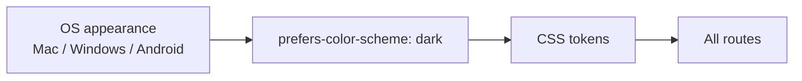

# Doc sync first, then dark mode

## Phase 1 — Sync docs to live site (do this first)

Compared [`app/globals.css`](app/globals.css), [`components/SiteShell.tsx`](components/SiteShell.tsx), [`components/SimpleHome.tsx`](components/SimpleHome.tsx), [`content/site.ts`](content/site.ts), and [`content/portfolio.ts`](content/portfolio.ts) against project docs. These are **wrong today**:

### [`PRODUCT.md`](PRODUCT.md)

| Stale | Live truth |
| --- | --- |
| Success = contact via Email or Twitter | Header: `email me` / `or` / `let's meet sometime` (Calendly). Twitter is footer-only. |
| A11y lists skip link | No skip-to-content link on site (by design) |
| Honor `prefers-reduced-motion` | Not wired; animations always on (your preference) |

**Edits:** Fix contact success line. A11y bullet → focus rings, landmarks, external-tab labels, 44px targets, safe-area. Delete reduced-motion line.

### [`DESIGN.md`](DESIGN.md) — largest drift

| Stale in doc | Live in code |
| --- | --- |
| `surface: #ffffff` | `#faf9f6` eggshell ([`globals.css` L11](app/globals.css)) |
| Brand rose "favicon only, not UI accent" | `--accent: #c08081` on hover/focus, open accordion titles, inline ↗ icons, pullquote borders |
| `focus-ring` = 42% ink | Interactive focus uses `--accent-focus-ring` (rose mix) |
| Header "Email + Twitter right" | Name left; contact nav = email + Calendly only ([`SiteShell.tsx`](components/SiteShell.tsx)) |
| "5 work-experience items" | **4** jobs + static education line ([`portfolio.ts`](content/portfolio.ts)) |
| Job titles = company names | Role-focused titles ("Working with Artists", "On-device AI"); company names in body links via `seoName` |
| Group gap `--space-6` | `--space-7` (48px) between project and experience groups |
| Optional "View project" rows | Removed; inline body links with `ExternalLinkArrow` ↗ |
| "Legacy footer icons not yet wired" | Wired: FA brands + legacy Giphy/Medium SVGs via [`SocialIcon.tsx`](components/SocialIcon.tsx) |
| Nav links "underline-on-hover" | No underlines; old rose on hover/focus/active |
| Intro measure ~32ch | `--home-measure-narrow: 34ch` |
| OG "code-generated renderer + Satoshi TTF" | Static Figma PNG at [`app/opengraph-image.png`](app/opengraph-image.png) |
| Motion lists `--ease-standard`, `--duration-press` | Not in `globals.css`; only `--ease-out`, `--ease-in`, `--duration-short` (250ms), `--duration-standard` (350ms) |
| `prefers-reduced-motion` in motion sidecar | Remove |
| Role line = secondary ink | Role uses tertiary muted (`--text-muted` / `home__line--role`) |
| Missing footer layout | LinkedIn-first order; mobile 8-col icon grid; meta row `2026` + coral favicon mark; desktop labels-only footer |

**Edits:** Update YAML frontmatter colors (add `accent`, fix `surface`). Rewrite Overview, Colors, Components, Motion sections to match live. Source of truth for tokens = `globals.css`; source of truth for layout = `SiteShell` + `SimpleHome`.

### [`README.md`](README.md)

File is corrupted (unrelated JS snippet). Replace with a short accurate readme: stack (Next.js App Router), dev commands (`npm run dev`, `npm test`, Playwright), deploy (Vercel on push to main), pointer to `PRODUCT.md` / `DESIGN.md`.

### [`.gstack-design-audit/motion-audit.md`](.gstack-design-audit/motion-audit.md)

Describes obsolete JS height-measure animation and `--animating` class. Live accordion ([`AnimatedDetails.tsx`](components/AnimatedDetails.tsx) + [`globals.css`](app/globals.css)) uses CSS grid `0fr` → `1fr` with `--opening` / `--closing` classes and 350ms open / 250ms close.

**Edits:** Rewrite "Apple HIG alignment (current)" table to match grid + opacity behavior. Fix count: **7** dropdowns (3 projects + 4 jobs), not 8. Keep deferred note that reduced-motion is intentionally unwired.

### Out of scope for Phase 1

- `.agents/skills/hallmark/**` — third-party skill refs, not site docs
- [`AGENTS.md`](AGENTS.md) — agent memory; one minor drift (`home__inline-separator` doc says rose accent, live CSS uses muted). Fix only if you want agent memory aligned; not blocking doc sync.

### Phase 1 verification

- Read-through: every claim in PRODUCT.md and DESIGN.md traceable to a file in repo
- No code changes in Phase 1 except README if we add dev commands that match `package.json`

---

## Phase 2 — Dark mode (after docs are accurate)

### Invert vs effort (unchanged)

**Not a simple invert.** Apple HIG: semantic roles get hand-tuned dark values, not negated light hex. Your CSS is already tokenized — one `@media (prefers-color-scheme: dark)` block in [`app/globals.css`](app/globals.css) plus tests.



### Apple HIG (summary)

- Semantic tokens (`--ink`, `--surface`, `--accent`, etc.) swap per scheme
- Tinted dark surface ~`#1a1a1c`, label ~`#f5f5f7`, not pure black/white
- `color-scheme: light dark` on `:root`
- OG image stays light
- No `prefers-reduced-motion`

### Implementation sketch

```css
@media (prefers-color-scheme: dark) {
  :root {
    color-scheme: dark;
    --ink: #f5f5f7;
    --ink-secondary: #aeaeb2;
    --ink-tertiary: #8e8e93;
    --surface: #1a1a1c;
  }
}
```

Add dark palette table to DESIGN.md **after** Phase 1 light palette is correct.

### Tests + QA

- Playwright: `page.emulateMedia({ colorScheme: 'dark' })` for body copy color
- Visual pass on `/`, `/expression`, `/ondevice`

---

## Effort

| Phase | Task | Time |
| --- | --- | --- |
| 1 | PRODUCT.md | ~10 min |
| 1 | DESIGN.md rewrite | ~30 min |
| 1 | README + motion-audit | ~15 min |
| 2 | Dark tokens + DESIGN dark table | ~30 min |
| 2 | E2E + visual QA | ~40 min |
| **Total** | | **~2 hours** |
