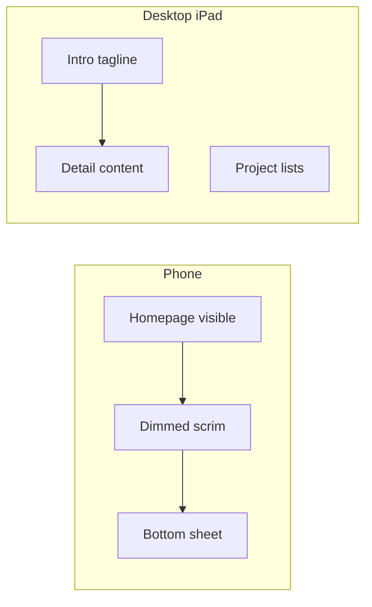

# Detail panel: bottom sheet + split view

## Design intent

Treat project detail as a **first-class region of the homepage shell**, not a bolt-on modal. If we had known this on day one, the shell would have three regions: **intro (tagline)**, **work (lists)**, and **detail (optional)**.

**Apple alignment (confirmed):** Tagline stays as the persistent primary-column header; detail content stacks below it in the left pane. This matches Mail (account header + folders) and Settings (section title + rows). Lists stay interactive on the right as the secondary pane.


| Viewport            | HIG pattern   | Our mapping                                                       |
| ------------------- | ------------- | ----------------------------------------------------------------- |
| `< 40rem` (compact) | Sheet (modal) | Bottom sheet + dimmed scrim; homepage not interactive             |
| `≥ 40rem` (regular) | Split view    | Balanced two-pane: primary (tagline + detail) | secondary (lists) |


Motion reuses existing tokens from `[lib/motion.ts](lib/motion.ts)` and `[app/styles/tokens.css](app/styles/tokens.css)` (`--ease-out`, `--ease-in`, 350/250ms). Enter/exit use **transform + opacity only** (no bounce, no elastic). Scrim on mobile only.

---

## Apple HIG compliance (sheets + split views)

Reference: [Sheets](https://developer.apple.com/design/human-interface-guidelines/sheets), [Split views](https://developer.apple.com/design/human-interface-guidelines/split-views). Web adaptation below; we follow HIG *behaviour and structure*, not Liquid Glass materials (site uses solid eggshell surface per `[DESIGN.md](DESIGN.md)`).

### Sheets (phone, compact width)


| HIG requirement                             | Implementation                                                                                                                 |
| ------------------------------------------- | ------------------------------------------------------------------------------------------------------------------------------ |
| Scoped task related to current context      | Expression/OnDevice opened from inline accordion link on same page                                                             |
| Modal sheet: parent dimmed, not interactive | `.home__scrim` + `inert` on `.home` while sheet open                                                                           |
| One sheet at a time                         | Only one `@detail` slot; no nested sheets                                                                                      |
| Close/Cancel on leading edge                | Top-leading close control (text "Close" or ×), 44px target                                                                     |
| Swipe down to dismiss                       | `pointer` drag on sheet header/grabber; threshold ~80px                                                                        |
| Grabber on resizable sheet                  | `.home__sheet-handle` (36×5px pill), `aria-label="Resize sheet"`                                                               |
| Detents (medium + large)                    | **Medium** ~50% viewport on open (progressive disclosure); drag/scroll expands to **large** ~92dvh; tap grabber cycles detents |
| Content inset from rounded corners          | `--space-5` padding inside sheet; no controls in 12px corner radius zone                                                       |
| Don't rely on Done-only exit                | Close + scrim tap + swipe + browser back all dismiss                                                                           |
| iPad in compact: sheet not split            | `matchMedia('(min-width: 40rem)')` fork; iPad portrait may still use sheet if below 40rem                                      |


**Explicitly not doing (brand constraints):** Liquid Glass / blur materials, glassmorphism scrim, decorative sheet chrome. Scrim = `color-mix(in srgb, var(--ink) 32%, transparent)` on solid surface.

### Split views (iPad/desktop, regular width)


| HIG requirement                                           | Implementation                                                                                 |
| --------------------------------------------------------- | ---------------------------------------------------------------------------------------------- |
| Use split view only in regular environment                | Split at `≥ 40rem`; compact uses sheet                                                         |
| Balanced style: reduce detail pane to show leading column | `.home__content--detail-open` widens left ratio (e.g. `1fr / 1fr`); lists compress, not hidden |
| Selection in primary pane persists in detail              | Triggering accordion row gets `.home__details[open]` + detail link `aria-current="page"`       |
| Thin divider between panes                                | Existing 1px `--separator` grid gap; no thick draggable divider (web has fixed columns)        |
| Logical navigation at intermediate widths                 | At 40–48rem: left column scrolls independently; lists remain tappable                          |
| Compact collapses to stack                                | Below 40rem: sheet replaces split (HIG: split needs horizontal space)                          |
| Tagline + detail in primary column                        | Tagline fixed at top of `.home__primary`; `.home__detail` scrolls below with `--space-5` gap   |


**Motion (split):** Detail block enters with `translateX(-16px → 0)` + opacity 0→1 (350ms ease-out). Tagline does not move (spatial anchor). Lists on right may subtly shift via `transform` on `.home__work`, not `grid-template-columns` animation (impeccable: no layout-property animation).

### Modality and navigation (both)

- **URL reflects state:** `/expression`, `/ondevice` on soft nav (shareable, back button works).
- **Close paths:** Close button, scrim (mobile), `Escape`, `router.back()`, header name → `/`.
- **Focus:** Trap in mobile sheet; on desktop split focus moves to detail region heading, returns to trigger on close.
- **No second sheet** when switching Expression ↔ OnDevice: replace detail content in place with cross-fade (150ms) if already open.

### Project-specific tension (documented)

- **Reduced motion:** Apple HIG recommends `prefers-reduced-motion`; this site intentionally keeps motion on (`[AGENTS.md](AGENTS.md)`). HIG compliance here = short durations, no parallax, no vestibular triggers (no scale bounce, no full-screen slide of background).
- **Pullquote rose left border:** Existing portfolio pattern; kept inside detail content. Not a sheet/split chrome element.

---

## Impeccable + design-review gate (before ship)

Run a focused pass (no full site audit) on the panel feature only:

1. **First impression:** Opening detail should feel like staying on the same site, not a new page load.
2. **Motion:** Only `transform` + `opacity`; 350ms open / 250ms close; asymmetric easing.
3. **Touch:** 44px close, grabber, scrim tap targets; safe-area insets on sheet bottom.
4. **AI slop check:** No glass cards, no purple gradients, no centered icon grids in sheet header.
5. **Trunk test with detail open:** Site name visible, current project clear, lists still navigable (desktop), obvious close path (mobile).
6. **Screenshots:** 390px sheet open/closed, 1024px split open, dark mode both.
7. **E2e:** No horizontal scroll; footer meta still within home padding when sheet closed.




---

## Architecture

### Routing: intercepting + parallel slot

Use Next.js **parallel routes** + **intercepting routes** so soft navigation from `/` opens the panel while hard loads keep full pages.

```
app/
  layout.tsx                    ← add { detail } slot
  page.tsx                      ← homepage (unchanged data)
  @detail/
    default.tsx                 ← null
    (.)expression/page.tsx      ← intercept soft nav
    (.)ondevice/page.tsx
  expression/page.tsx           ← full-page fallback (SEO, direct links)
  ondevice/page.tsx
```

- **Soft nav** (`/` → `/expression`): homepage stays mounted; `@detail` slot renders panel.
- **Hard nav** (`/expression` direct): full `[ProjectPage](components/ProjectPage.tsx)` as today (crawlers, shared links, no-JS).
- Close panel: `router.back()` or close button → returns to `/`.

### Content layer

Extract shared presentational content from `ProjectPage`:

- New `[components/ProjectDetail.tsx](components/ProjectDetail.tsx)` — intro role/tagline, accordion sections, optional Book demo CTA, updating note (no shell).
- New `[lib/detail-routes.ts](lib/detail-routes.ts)` — registry mapping `/expression` and `/ondevice` to `expressionContent` / `ondeviceContent` + metadata keys.
- `[ProjectPage](components/ProjectPage.tsx)` becomes a thin wrapper: `PortfolioShell` + `ProjectDetail` (full-page fallback unchanged visually).

### Presentation layer

- `[components/DetailPanel.tsx](components/DetailPanel.tsx)` (client) — reads viewport (`matchMedia` at `40rem`), mounts sheet vs split, handles open/close lifecycle.
- `[BottomSheet.tsx](components/BottomSheet.tsx)` — detents (medium/large), grabber, swipe dismiss, close leading, scrim.
- `[components/DetailSlot.tsx](components/DetailSlot.tsx)` — bridges `@detail` parallel route into `DetailPanel`; provides React context so homepage shell can apply layout class.

### Shell restructure

Refactor `[PortfolioShell](components/PortfolioShell.tsx)` to accept optional `detail` slot:

```tsx
// Left column at ≥40rem
<div className="home__primary">
  <section className="home__intro">…tagline…</section>
  {detail ? <div className="home__detail">{detail}</div> : null}
</div>
```

`[SimpleHome](components/SimpleHome.tsx)` passes `detail={null}` by default; when intercept is active, context/provider injects `ProjectDetail` into the left column.

Root layout wraps children with a lightweight provider:

```tsx
// app/layout.tsx
export default function RootLayout({ children, detail }) {
  return (
    <body>
      <DetailProvider detail={detail}>{children}</DetailProvider>
    </body>
  );
}
```

`[PortfolioShell](components/PortfolioShell.tsx)` / `[SimpleHome](components/SimpleHome.tsx)` consume `useDetail()` to render the split column. On mobile, `DetailPanel` portals sheet + scrim to `document.body` (outside `.home` max-width) so it can be full-bleed width.

---

## CSS (new `[app/styles/panel.css](app/styles/panel.css)`)

Import from `[app/globals.css](app/globals.css)`.

**Desktop split (`≥ 40rem`)**

- `.home__primary` — flex column; tagline + detail stack with `--space-5` gap; tagline does not scroll away.
- `.home__detail` — `overflow-y: auto`; `max-height: calc(100dvh - header - footer - tagline)`; `max-width: var(--home-measure-body)` (50ch).
- `.home__detail--enter` / `--exit` — `translateX(-16px → 0)` + opacity; synced to `ACCORDION_OPEN_MS` / `ACCORDION_CLOSE_MS`.
- `.home__content--detail-open` — grid `1fr / 1fr` (balanced split); lists stay fully interactive.
- `.home__inline-link[aria-current="page"]` — old rose text on trigger link when detail open (HIG selection persistence).

**Mobile sheet (`< 40rem`)**

- `.home__scrim` — `position: fixed; inset: 0`; `color-mix(in srgb, var(--ink) 32%, transparent)`; fade 350ms; tap dismisses.
- `.home__sheet` — `position: fixed; inset-inline: 0; bottom: 0`; top radius `12px`; **detents:** `--sheet-height-medium: 50dvh`, `--sheet-height-large: 92dvh`; default open at medium.
- `.home__sheet-handle` — 36×5px pill, centred, `--space-3` from top; `cursor: grab`; tap cycles medium ↔ large.
- `.home__sheet-header` — flex row; **Close** leading (`home__sheet-close`, 44px); detail title centred or leading after close.
- `padding-bottom: max(--space-5, env(safe-area-inset-bottom))`; surface background; 1px top `separator`.
- Body scroll lock: `overflow: hidden` on `html` while sheet open; sheet body scrolls independently.
- Swipe-down on sheet header/handle: dismiss when `deltaY > 80px` (HIG swipe dismiss).

**Global constraint:** Revisit `overflow-x: clip` on `html/body` in `[tokens.css](app/styles/tokens.css)` — sheet needs vertical scroll inside panel, not page behind.

---

## Interaction and accessibility

- **Focus trap** in mobile sheet; **Escape** closes; return focus to triggering link.
- `**inert**` on `.home` while mobile sheet open.
- Mobile sheet: `role="dialog"`, `aria-modal="true"`, `aria-labelledby` → detail `h2`.
- Desktop split: not modal; trigger link `aria-expanded="true"` + `aria-current="page"`; detail region `aria-label={pageLabel}`.
- **Accordion coexistence:** `[AnimatedDetails](components/AnimatedDetails.tsx)` already ignores summary clicks on `<a>`.
- **Close affordances (HIG):** Close (leading), scrim tap, swipe down, browser back. No Done-only exit.
- **Detents (HIG):** Sheet opens at medium (~50%); expand via grabber tap, scroll-up expansion, or drag handle up. Expression content (3 sections) suits progressive disclosure.
- **Selection highlight (HIG split):** Parent accordion stays open; active inline link styled as current selection.

---

## Links and portfolio data

No change to hrefs in `[content/portfolio.ts](content/portfolio.ts)` (`/expression`, `/ondevice`). `[PortfolioList](components/PortfolioList.tsx)` keeps `next/link` — intercepting routes handle the rest.

Header name link on homepage stays Spotify easter egg; when detail is open, name still navigates home (closes detail via route change).

---

## SEO, sitemap, tests

- Keep `[app/expression/page.tsx](app/expression/page.tsx)`, `[app/ondevice/page.tsx](app/ondevice/page.tsx)`, sitemap, and `[lib/site-seo.ts](lib/site-seo.ts)` entries unchanged.
- **E2e updates** in `[e2e/home.spec.ts](e2e/home.spec.ts)`:
  - Mobile: click inline link → sheet visible, URL `/expression`, homepage still in DOM.
  - Desktop (≥40rem): click link → detail in left column under tagline, lists visible on right, no full page navigation.
  - Close restores `/` and removes detail.
- `[e2e/seo.spec.ts](e2e/seo.spec.ts)` and `[e2e/dark-mode.spec.ts](e2e/dark-mode.spec.ts)`: full-page routes still pass; add panel token check on soft nav.

---

## Docs

Update `[DESIGN.md](DESIGN.md)` sub-pages section to describe panel/split patterns (replacing "minimal ProjectPage layout" as the primary interaction). No PRODUCT.md strategy change — still brand register, still extreme simplicity.

---

## Implementation order

1. Extract `ProjectDetail` + `detail-routes` registry (no UX change yet).
2. Add `panel.css` + motion constants (include detent height tokens).
3. Build `BottomSheet` (detents, grabber, swipe) + `DetailPanel` (client).
4. Refactor `PortfolioShell` left column (`home__primary`) + `DetailProvider`.
5. Wire `@detail` parallel + intercepting routes in `app/layout.tsx`.
6. Slim `ProjectPage` to reuse `ProjectDetail`.
7. **HIG design-review gate:** screenshots + checklist at 390px and 1024px, light/dark.
8. E2e updates; verify no horizontal scroll regression.

---

## Shape brief (confirmed)

- Tagline stays fixed on desktop; detail stacks below.
- Lists remain interactive on the right (balanced split).
- Mobile: HIG sheet with medium detent, grabber, swipe dismiss, Close leading.
- Motion: 350/250ms asymmetric; transform + opacity only.
- Solid surface, no glass; no cards in panel chrome.

