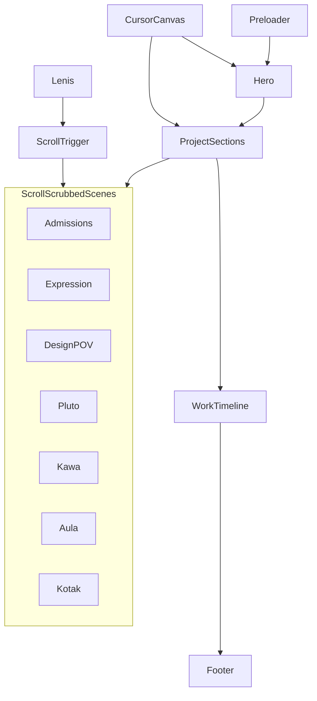

# rashOS World-Class Animation Overhaul

## Design north star

**Quiet stage, loud work.** Warm paper base, black ink, old rose accent used sparingly. Nothing small or cute. Soft brutalism: big type, fast meaningful motion, unified palette everywhere.

**Corrected palette** (replaces per-project color zones in `[lib/colors.ts](lib/colors.ts)` and `[components/providers/ColorZoneProvider.tsx](components/providers/ColorZoneProvider.tsx)`):


| Token     | Hex       | Use                                      |
| --------- | --------- | ---------------------------------------- |
| base      | `#f5ede8` | All sections                             |
| ink       | `#111010` | Text, strokes, coral branches            |
| old rose  | `#c08081` | Accent, gradient bleed, hover underlines |
| grey-blue | `#8fa0b4` | Labels, metadata                         |
| navy      | `#1a2038` | Rare deep moments only                   |


**Hard rule:** Every scene, UI mock, cursor state, and animation uses only these five tokens. No brand reds, greens, rainbow fills, or off-palette accents anywhere on the site.

---

## What "exit" means (preloader)

**Exit = how the loader leaves the screen when it's done.** Not a separate feature. After the coral animation plays out, the full-screen loader slides up (`clip-path` or `y: -100%`) to reveal the site underneath. Today this happens in ~0.65s at `[Preloader.tsx:164-173](components/sections/Preloader.tsx)`. Plan: **slow the whole timeline down** so people can soak in the reef, then exit smoothly — not rushed.

---

## Element-by-element spec

### 1. Preloader — `[components/sections/Preloader.tsx](components/sections/Preloader.tsx)`

Black thick SVG coral branches draw bottom-up via `strokeDashoffset`; branches sway with brutal GSAP loops (already started). **Change:** old rose gradient (`#c08081`) bleeds root-to-tip at **low opacity (~25–40%)** so it melts into `#f5ede8` base — not a solid pink fill. Extend hold phase ~1.5–2s after draw completes before exit wipe. Exit: full-height upward wipe revealing hero (keep existing mechanic, slower easing).

### 2. Hero copy — `[components/sections/Hero.tsx](components/sections/Hero.tsx)`

- **Headline (h1):** `apps and ai tools designer and engineer` — lowercase, large Cabinet Grotesk Bold, minimal decoration
- **Eyebrow:** `originally a product manager` — lowercase, small, grey-blue, no rose underline or extra chrome
- Remove current subtitle ("PM who builds…") and `rashOS` eyebrow
- Thick vertical scroll bar pulse (item 7 — keep)

### 3. Hero interaction — replace `[components/scenes/HeroScene.tsx](components/scenes/HeroScene.tsx)` (**no WebGL**)

Remove `SceneCanvas` from hero entirely. Two refs drive this:

- **[Fiddle Digital canvas grid](https://www.awwwards.com/inspiration/canvas-grid-fiddle-digital-design-agency):** interactive **modular rectangular grid** — evenly spaced black-bordered cells on `#f5ede8` that shift, compress, and skew on cursor proximity (not organic blobs). Structured like a broken layout system: columns slide, rows offset, cells scale 1–1.15× near pointer. WebGL or 2D canvas. Feels alive and intentional, not SaaS dashboard or amorphous.
- **[Duten texture hover reveal](https://www.awwwards.com/inspiration/texture-hover-reveal-duten):** headline gets a grain/warm-texture layer masked by mouse position — moving cursor reveals subtle texture through the letterforms. Implement as CSS `background-clip: text` + pointer-driven mask, or canvas overlay synced to headline bounds.

Background canvas + texture-reveal headline work together; scene stays lightweight (no heavy 3D).

### 4. Admissions scene — `[components/scenes/AdmissionsScene.tsx](components/scenes/AdmissionsScene.tsx)`

Port the **ApplicantTable + rubric** concept from `[admissions-landing 2](file:///Users/raash/Documents/Admission%20Scoring/Repos/admissions-landing%202)`:

- Mini dashboard panel (HTML/SVG in R3F `Html` or pure 2D canvas overlay) styled like landing: applicant rows, synthesis tags (`STEM`, `Leadership`), status dots
- **Custom rubric sidebar** animates on scroll: weighted categories (e.g. Academics 65%, Extracurricular 89%, Essay 74%, Interview 98%) — bars fill as scroll progresses, one row highlights and tags snap in
- Source reference: `[ApplicantTable.tsx](file:///Users/raash/Documents/Admission%20Scoring/Repos/admissions-landing%202/src/components/ApplicantTable.tsx)` + JBCN rubric principles from Second Brain

### 5. Expression scene — `[components/scenes/ExpressionScene.tsx](components/scenes/ExpressionScene.tsx)`

A **character** (simple line-art figure, not abstract planes) performs a **cartwheel** across a horizontal frame strip — classic frame-by-frame animation pose sequence (5–8 key poses), scrubbed by scroll.

As the character moves, **flat colour fills** propagate region-by-region on each frame:

- **Ink `#111010`** — outlines and line art (always on top)
- **Base `#f5ede8`** — uncoloured / paper areas
- **Old rose `#c08081`** — filled regions (skin, clothing zones) bleeding in behind the lines

Shows what Expression actually does: hand-drawn line art → automatic flat colouring. **Priority: smooth interpolation** — lerp fill progress per region per frame, no stepped jumps; only the three colours above (plus grey-blue `#8fa0b4` for optional frame labels if needed).

### 6. Design POV scene — `[components/scenes/DesignPovScene.tsx](components/scenes/DesignPovScene.tsx)`

**Not** "built in 12hrs" in animation (keep that in `[content/projects.ts](content/projects.ts)` copy only).

Exhibition floor plan: abstract booth shapes (circles, rects, triangles) on a map; animated visitor dot traces a path through booths; **offline badge** flickers once then stays solid. Scroll scrubs path progress. Inspired by Design POV booth map vocabulary from Second Brain.

### 7. Pluto scene — `[components/scenes/PlutoScene.tsx](components/scenes/PlutoScene.tsx)`

Replace vague blob/box. **Concrete concept:** Pluto was a creative studio turned product company (Create: 500 users, 5k assets in 10 days).

- Start: scattered irregular asset thumbnails (abstract shapes, like generated art tiles) floating chaotically
- Scroll: tiles **magnetize** into a clean 3×2 product grid inside a wallet/app frame silhouette
- Represents studio chaos → shipped product. No generic "tags" — actual visual assets snapping into a gallery UI.

### 8. Kawa scene — `[components/scenes/KawaScene.tsx](components/scenes/KawaScene.tsx)`

Pre-GPT-3 geospatial chatbot story:

- Chat UI panel: user message *"Is it raining in Shoreditch?"* (place name, not coordinates — feels human, still geospatial)
- Rainfall heatmap layer animates in behind (`#8fa0b4` cells pulsing on `#f5ede8` base, `#1a2038` for wet zones)
- Bot reply types in: *"Yes — moderate rainfall across the western sector."*
- Scroll scrubs: message → map check → answer. Dialogflow-era NLP on maps, not a generic green terrain stack.

### 9. Aula scene — `[components/scenes/AulaScene.tsx](components/scenes/AulaScene.tsx)`

Wild online classroom: professor screen, student video tiles popping in, chat bubbles scrolling, hand-raise icons. EdTech energy, not retention bar charts. Scroll drives class "session" from empty room → full live lecture.

### 10. Kotak scene — `[components/scenes/KotakScene.tsx](components/scenes/KotakScene.tsx)`

Consumer trading app, not corporate bar chart:

- Live ticker strip with symbol + price (`#111010` on `#f5ede8`)
- Swipeable stock card (gesture implied via scroll)
- Portfolio ring / P&L pulse — **palette only:** old rose `#c08081` for positive pulse, navy `#1a2038` for depth, grey-blue `#8fa0b4` for secondary labels (no brand reds or off-palette colors)
- Order confirmation flash — feels like Neo app, not Bloomberg terminal

### 11. Typography scale — `[app/globals.css](app/globals.css)`

Bump project titles to `clamp(80px, 10vw, 140px)`; taglines `clamp(18px, 2vw, 26px)`; section labels 11px caps grey-blue. **You'll tune after seeing it** — ship sensible defaults first.

### 12. Text animations — `[components/effects/TextReveal.tsx](components/effects/TextReveal.tsx)`

- Section titles: char stagger, `y: 60 → 0`, `power4.out`, fast (0.5s)
- Body: word scrub reveal on scroll (`opacity 0.15 → 1`)
- Consider GSAP SplitText if licensed; else keep current span-split approach

### 13. Cursor — `[components/cursor/Cursor.tsx](components/cursor/Cursor.tsx)`

Replace dot+ring with **brushstroke trail** ([Petra Garmon ref](https://www.awwwards.com/inspiration/cursor-desktop-petra-garmon)):

- Canvas layer: rough ink strokes linger ~400ms and fade
- **Default:** brush trail only
- **Link hover:** horizontal text-caret line (item 27)
- **Project section:** larger soft rose-tinted brush blob + project name label — adapted from current `project` state (item 26)
- **Magnetic links:** `[useMagnetic.ts](components/cursor/useMagnetic.ts)` — pull brush origin toward target within 80px, stroke thickens on snap

Disable on `pointer: coarse` (keep current behavior).

### 14. Scroll pacing — keep Lenis default

**No** speed bump to 1.4 (you said no). Keep existing Lenis config. Pin duration and scrub can still tighten per-section in `[ProjectSection.tsx](components/sections/ProjectSection.tsx)` if scenes need more runway.

### 15. Work timeline — `[components/sections/WorkTimeline.tsx](components/sections/WorkTimeline.tsx)`

Vertical line draws on scroll; entries slam from left; metric counters animate. Ship as planned — you'll review visually.

### 16. Footer — `[components/sections/ConnectFooter.tsx](components/sections/ConnectFooter.tsx)`

- Name stretch on hover (item 32) — keep
- Social links: static list with rose underline on hover — **no scroll marquee** (item 33)
- Loop scroll at page end (item 34) — keep

### 17. Unified palette cleanup

- Add `[lib/palette.ts](lib/palette.ts)` — single hex source for five tokens
- Collapse `[projectPalettes](lib/colors.ts)` on scroll journey only
- **Remove `[ColorZoneProvider](components/providers/ColorZoneProvider.tsx)`** — use `data-active-section` for cursor project label; global CSS vars from `lib/palette.ts`
- Stop zone background swaps in `[ProjectSection.tsx](components/sections/ProjectSection.tsx)` and `[ProjectSceneRouter.tsx](components/scenes/ProjectSceneRouter.tsx)`
- `**/project/[slug]` pages out of scope** — leave existing per-project palette there for now
- Update `[AGENTS.md](AGENTS.md)`: old rose `#c08081`, new hero copy

### 18. DESIGN.md

Write `[DESIGN.md](DESIGN.md)` at repo root capturing palette, motion principles, cursor spec, scene one-liners, and Awwwards refs — becomes source of truth for future UI work.

---

## Architecture




---

## Engineering decisions (from /plan-eng-review)


| #               | Decision                                                                                                                                             |
| --------------- | ---------------------------------------------------------------------------------------------------------------------------------------------------- |
| Scope           | Full plan in one pass                                                                                                                                |
| Renderers       | **Split:** Scene2D (SVG/canvas) for Admissions, Design POV, Kawa, Kotak, Aula, Expression; R3F for **Pluto only**                                    |
| Scene mount     | **TBD** — benchmark lazy mount vs mount-all+pause before scene work (Codex flagged mount-all cost)                                                   |
| Hero            | **No WebGL** — 2D modular grid + CSS texture headline; remove `SceneCanvas` from hero                                                                |
| Palette         | `**lib/palette.ts**` single hex source → CSS vars + scene materials                                                                                  |
| Router          | `**Scene2D` wrapper** + `ProjectSceneRouter` slug map `{ type: '2d'                                                                                  |
| ColorZone       | **Remove `ColorZoneProvider`** — active section via `data-active-section` on scroll container for cursor label only; palette is global, not per-slug |
| Expression      | SVG cartwheel strip in Scene2D (not R3F planes)                                                                                                      |
| Text            | Extend `TextReveal.tsx` (chars + scrub-words); **no GSAP Club SplitText**                                                                            |
| Tests           | Vitest unit tests + **Playwright E2E** with `?e2e=1` test mode (skip preloader, disable Lenis/cursor)                                                |
| Animation loops | `**lib/animation-ticker.ts**` shared RAF for cursor + Scene2D; R3F keeps its own loop; document ownership                                            |
| ScrollTrigger   | `refresh()` after **preloader complete + `ready=true`**, scene mount batch, and debounced resize                                                     |
| Project pages   | **Out of scope** — leave `/project/[slug]` palette as-is for now                                                                                     |


---

## Implementation order (revised)

```
Phase 0 — Infra contract
  lib/palette.ts → globals.css vars
  lib/animation-ticker.ts
  Scene2D.tsx + ProjectSceneRouter refactor (2d/3d map)
  Remove ColorZoneProvider; data-active-section for cursor
  ?e2e=1 test harness in ScrollJourney/Preloader
  Mount strategy spike (lazy vs mount-all) — measure, then lock

Phase 1 — Chrome
  Preloader (transparent #c08081 bleed, slower soak)
  Hero copy + 2D grid + texture headline (no R3F)
  Brushstroke cursor on shared ticker

Phase 2 — Scenes (one at a time)
  Admissions → Expression → Design POV → Kawa → Aula → Kotak → Pluto (R3F)

Phase 3 — Polish
  Typography scale, TextReveal scrub mode
  Timeline + footer
  DESIGN.md + AGENTS.md
  Playwright + vitest suites
```

---

## What already exists (reuse, don't rebuild)

- `Preloader.tsx` — coral SVG + GSAP timeline (tune, don't rewrite)
- `SceneCanvas.tsx` — R3F wrapper with coarse-pointer dpr cap + `enabled` gate
- `ProjectSection.tsx:54-65` — IntersectionObserver lazy mount (benchmark baseline)
- `TextReveal.tsx` — char/word span split (extend for scrub)
- `SmoothScroll.tsx` — Lenis + ScrollTrigger proxy
- `prefersReducedMotion()` in `lib/animations.ts`
- Vitest in `package.json` (API tests only today)

---

## NOT in scope (this pass)

- Spotify widget changes
- `**/project/[slug]` pages** — palette, layout, OG images unchanged (per review)
- Mobile cursor (stays native touch; coarse-pointer degradations preserved)
- Literal 3D model imports
- GSAP Club SplitText license

---

## Performance budget (add to DESIGN.md)


| Metric                   | Target                                                    |
| ------------------------ | --------------------------------------------------------- |
| Desktop scroll           | 60fps pinned sections                                     |
| Max active RAF sources   | 3 (Lenis + shared ticker + 1 R3F canvas)                  |
| Scene mount              | TBD after spike — default lean toward existing lazy mount |
| `prefers-reduced-motion` | Preloader skip, static scenes, no cursor canvas           |


---

## Test plan summary

**Unit (Vitest):** `lib/palette.test.ts`, `lib/scene-progress.test.ts` (progress→frame/act mappers), TextReveal scrub helper

**E2E (Playwright):** hero headline visible, preloader skipped via `?e2e=1`, project section titles present, scroll to footer

**Manual `/qa`:** motion feel, brushstroke cursor, scene story clarity

---

## Implementation Tasks

- [ ] **T1 (P1)** — `lib/palette.ts` + CSS var wiring — single source for five tokens
- [ ] **T2 (P1)** — Scene2D + router 2d/3d contract before any scene content
- [ ] **T3 (P1)** — `lib/animation-ticker.ts` + migrate cursor to shared RAF
- [ ] **T4 (P1)** — `?e2e=1` test mode + Playwright scaffold
- [ ] **T5 (P2)** — Mount strategy benchmark spike, document result in plan
- [ ] **T6 (P2)** — Remove ColorZoneProvider; `data-active-section` cursor wiring
- [ ] **T7 (P1)** — Hero: drop WebGL, 2D grid + texture headline
- [ ] **T8 (P1)** — Preloader rose bleed + slower soak timeline
- [ ] **T9 (P1)** — Rebuild 7 scenes per element spec (2D except Pluto)
- [ ] **T10 (P2)** — ScrollTrigger.refresh sequencing around preloader/ready
- [ ] **T11 (P2)** — Extend TextReveal scrub-words mode
- [ ] **T12 (P3)** — DESIGN.md + AGENTS.md

---

## Success criteria

- Loader feels intentional, rose blends into paper base
- Hero reads your new positioning without consultant tone
- Each project scene tells its story in under 5 seconds of scrolling
- Cursor feels distinctive (brushstroke), not default dot
- One palette on scroll journey — **no colors outside the five tokens**
- Animations run 60fps on desktop; `prefers-reduced-motion` respected throughout
- Playwright E2E passes in CI with `?e2e=1`

---

## GSTACK REVIEW REPORT


| Review        | Trigger               | Why                             | Runs | Status       | Findings                                           |
| ------------- | --------------------- | ------------------------------- | ---- | ------------ | -------------------------------------------------- |
| CEO Review    | `/plan-ceo-review`    | Scope & strategy                | 0    | —            | —                                                  |
| Codex Review  | `/codex review`       | Independent 2nd opinion         | 0    | —            | —                                                  |
| Eng Review    | `/plan-eng-review`    | Architecture & tests (required) | 1    | issues_open  | 13 decisions, mount TBD, router-first sequencing   |
| Design Review | `/plan-design-review` | UI/UX gaps                      | 0    | —            | —                                                  |
| Outside Voice | codex-plan-review     | Blind spots                     | 1    | issues_found | mount-all challenged, RAF ownership, E2E test mode |


- **UNRESOLVED:** 1 (mount strategy — investigate before scene work)
- **VERDICT:** ENG review complete with open items — ready to implement after mount spike

