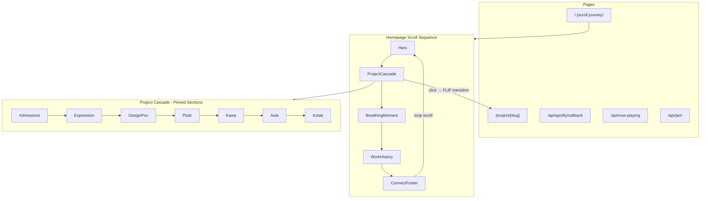

# rashOS Full Rebuild Plan

## Architecture Overview

Tear down the current OS-shell SPA. Replace with a scroll-driven journey site built on the same Next.js 15 + App Router stack, adding GSAP (ScrollTrigger, SplitText, Flip) and React Three Fiber for bespoke project scenes.




## New Dependencies

```
gsap (Club GSAP - includes ScrollTrigger, ScrollSmoother, SplitText, Flip, Observer, Draggable)
@gsap/react (useGSAP hook for cleanup in React)
three
@react-three/fiber
@react-three/drei (helpers: Float, Environment, useProgress, Html)
lenis (smooth scroll - alternative to ScrollSmoother if licensing is an issue)
```

**GSAP Plugins required:**

- ScrollTrigger (pin, scrub, snap)
- ScrollSmoother (inertia smooth scroll, parallax via data-speed, velocity)
- SplitText (character/word/line splitting for text reveals)
- Flip (page transition element morphing)
- Observer (scroll intent detection for loop scroll)
- CustomEase (for the precise easing curves)

**Font:** Cabinet Grotesk via `next/font/local` (download from fontshare.com, self-host in `public/fonts/`). Remove Manrope.

**Note on GSAP licensing:** ScrollSmoother, SplitText, and Flip require GSAP Club/Business. If that's a blocker, alternatives: Lenis for smooth scroll, manual char splitting, and View Transitions API for FLIP. But Club GSAP is $99/year and worth it for this build.

## New File Structure

```
app/
  layout.tsx                 # Cabinet Grotesk font, global providers (SmoothScroll, Cursor, Sparkle)
  globals.css                # NEW: light warm base design system + CSS vars for zones
  page.tsx                   # Scroll journey (replaces <RashOS />)
  project/[slug]/page.tsx    # Project detail pages (FLIP target)
  project/[slug]/layout.tsx  # Shared layout for transition element persistence
  api/
    now-playing/route.ts     # KEEP (refactor slightly)
    jam/route.ts             # NEW: Spotify Jam session link
    spotify/callback/route.ts # NEW: OAuth flow

components/
  providers/
    SmoothScroll.tsx         # ScrollSmoother wrapper (inertia, velocity, parallax)
    TransitionProvider.tsx   # FLIP page transition state + animation orchestration
    SparkleProvider.tsx      # Canvas overlay for sparkle cursor (object-pooled particles)
    ColorZoneProvider.tsx    # Tracks current active zone, provides palette to children

  cursor/
    Cursor.tsx               # Custom cursor renderer (morph states, lerp position)
    useMagnetic.ts           # Hook: makes an element magnetically attract cursor
    useCursorState.ts        # Hook: set cursor morph state on hover

  sections/
    Hero.tsx                 # Statement + subtle R3F backdrop + scroll indicator
    Preloader.tsx            # Load choreography (name → progress → reveal)
    ProjectSection.tsx       # Single pinned project (scene + copy + CTA + palette zone)
    BreathingMoment.tsx      # Personality one-liners, Spotify widget, or habit tracker
    WorkTimeline.tsx         # Scroll-animated role entries with graphic moments
    ConnectFooter.tsx        # Social + loop trigger + name hover interaction
    ScrollProgress.tsx       # 1px top bar + optional dot navigation

  scenes/                    # React Three Fiber scenes (one per project)
    AdmissionsScene.tsx      # Floating docs being sorted/graded (scroll-scrubbed)
    ExpressionScene.tsx      # Filmstrip frames filling with colour + Figma character
    DesignPovScene.tsx       # Device going offline, content still loading
    PlutoScene.tsx           # Organic blobs morphing to geometric
    KawaScene.tsx            # Terrain layers assembling (mint)
    AulaScene.tsx            # Community nodes/connections (purple + mint)
    KotakScene.tsx           # Financial chart/trading visual (red)
    HeroScene.tsx            # Subtle ambient particles/shapes behind hero text
    SceneFallback.tsx        # Shimmer placeholder while scene loads (Suspense boundary)

  effects/
    SparkleTrail.tsx         # Cursor sparkle particle system (canvas, object-pooled)
    TextReveal.tsx           # GSAP SplitText wrapper (char/word/line modes)
    FlipLink.tsx             # Link component that orchestrates FLIP to project page
    LoopScroll.tsx           # Infinite loop scroll handler (Observer + crossfade)
    ParallaxLayer.tsx        # Wrapper: applies data-speed parallax to children
    GrainOverlay.tsx         # Film grain texture (SVG feTurbulence or tiled PNG)
    VelocitySkew.tsx         # Applies scroll-velocity-driven skew to children
    ColorWipe.tsx            # Radial clip-path transition for entering project zones

  widgets/
    NowPlaying.tsx           # Spotify now-playing (album art Ken Burns on hover)
    JoinJam.tsx              # Live Jam link button (pulses when active)
    HabitTracker.tsx         # Protein/health widget (future, placeholder structure)

content/
  projects.ts               # REWRITE: 7 projects with palettes, copy, scene config
  roles.ts                   # UPDATE: same roles, new one-liner copy
  site.ts                    # KEEP: social links
  breathing.ts              # Personality one-liners for between-section moments

lib/
  spotify.ts                 # Token refresh, now-playing, jam session helpers
  animations.ts              # Shared GSAP defaults, easing curves, ScrollTrigger configs
  colors.ts                  # Per-project OKLCH palettes as typed constants
  hooks/
    useScrollVelocity.ts     # Exposes smoothed scroll velocity as reactive value
    useInView.ts             # Triggers callbacks when element enters/exits viewport
    usePreload.ts            # Preloads next scene 500px before it enters viewport

public/
  fonts/
    CabinetGrotesk-Regular.woff2
    CabinetGrotesk-Bold.woff2
    CabinetGrotesk-Black.woff2
  textures/
    grain.png                # Tileable noise texture for GrainOverlay
  img/
    pro.jpeg                 # KEEP
    casual.jpeg              # KEEP
```

## Design System (globals.css rewrite)

**Base palette (warm paper-white):**

- `--bg-base: oklch(97% 0.008 80)` (warm off-white)
- `--bg-section: oklch(95% 0.006 78)` (breathing sections)
- `--text-primary: oklch(18% 0.01 50)` (warm near-black)
- `--text-muted: oklch(42% 0.01 50)`
- `--accent: oklch(55% 0.12 280)` (a subtle purple-ish interactive accent, TBD)

**Per-project color zones (in `lib/colors.ts`):**

- Admissions: `oklch(22% 0.04 250)` bg + `oklch(62% 0.18 250)` accent (deep navy + electric blue)
- Expression: `oklch(58% 0.2 30)` multi-hue pigments
- Design POV: `oklch(12% 0.005 0)` bg + `oklch(55% 0.22 25)` accent (black + red)
- Pluto: `oklch(82% 0.08 75)` (warm amber)
- Kawa Space: `oklch(78% 0.14 160)` (mint green)
- Aula: `oklch(52% 0.18 290)` + `oklch(78% 0.12 170)` (purple + mint)
- Kotak: `oklch(55% 0.22 25)` (Kotak Red)

**Typography:**

- Cabinet Grotesk Black: hero headings (8-12vw)
- Cabinet Grotesk Bold: section headings
- Cabinet Grotesk Regular: body (1rem, 1.6 line-height, max 65ch)

## Interaction Design System (the craft layer)

Everything below is what separates "nice portfolio" from "best personal website in the world." This section defines every animation, every hover state, every scroll response across the entire site.

### Smooth Scroll Foundation

Use GSAP ScrollSmoother (or Lenis + ScrollTrigger integration). This gives:

- Inertia-based scrolling (content has weight, doesn't stop instantly)
- Buttery 60fps frame-interpolated scroll position
- Velocity data exposed to all other animations
- All ScrollTrigger pins work perfectly within the smooth scroll wrapper

Structure: `SmoothScroll.tsx` wraps the entire page content. Every scroll-driven animation reads from this smoothed position, not native scroll.

### Custom Cursor System

A multi-state custom cursor that communicates what's interactive:

- **Default state:** Small circle (8px), warm near-black, slight trail/lag behind actual mouse (lerp 0.15)
- **Hovering text/link:** Circle grows to 40px, becomes hollow ring, text appears inside ("view" / "explore" / "listen")
- **Hovering project section:** Circle grows to 80px, fills with the project's accent color at 20% opacity, text says "dive in"
- **Hovering 3D scene:** Cursor becomes a crosshair or dot, scene responds to cursor position
- **Dragging/scrolling fast:** Circle compresses vertically (squish in scroll direction), returns to round on stop
- **Over footer name:** Cursor explodes into sparkle cloud

Implementation: A `<Cursor />` component that renders a `div` with GSAP-driven position (lerp to mouse coordinates), scale/shape tweens on element hover via data attributes or IntersectionObserver proximity.

Cursor hidden on mobile (touch devices).

### Magnetic Hover (buttons, CTAs, social links)

Interactive elements within 80px of cursor pull toward it. When cursor enters this proximity zone:

1. Element translates up to 8px toward cursor position (lerp)
2. Element scales up 1.02-1.05x
3. On cursor exit: element springs back with slight overshoot (elastic ease)

Applied to: all buttons, social link icons, project CTAs, Spotify widget, footer links. NOT applied to body text or headings (those get text reveal instead).

Implementation: `useMagnetic()` hook that attaches mousemove listener, calculates distance, applies GSAP quickTo for the translate.

### Scroll Velocity Responses

The site responds to HOW FAST you're scrolling:

- **Text skew:** Body text skews 1-3deg in scroll direction at high velocity (returns to 0 on stop). Subtle, almost subliminal.
- **Scene parallax intensity:** Three.js scenes have deeper parallax offset at higher scroll speed (objects separate more in z-depth).
- **Breathing moments compress:** The spacing between project sections compresses slightly at speed (via ScrollSmoother effects).
- **Image/element motion blur:** At very high velocity (>2000px/s), a CSS blur(1px) + slight translateY offset gives a motion blur impression.

Implementation: `ScrollSmoother.getVelocity()` feeds a `gsap.quickTo()` on a CSS variable `--scroll-velocity` that elements read.

### Page Load Choreography (Preloader)

While Three.js assets load (textures, geometries), the user sees:

1. **0-500ms:** Solid warm background. Your name "raashi" renders in Cabinet Grotesk Black, centered, at 20vw. Cursor sparkle already active (gives immediate life).
2. **500ms-load complete:** A thin progress line grows at the bottom of the viewport (1px, accent color). Name letters begin a very slow random drift (translateY +/- 2px per letter, staggered).
3. **On load complete:** Name letters animate OUT (stagger up with opacity 0). Progress line grows to full width instantly. Then:
  - Background fades from solid to the actual hero gradient (400ms)
  - Hero statement text reveals character by character (SplitText, stagger 0.02s, from below)
  - Subtle Three.js hero scene fades in
  - Scroll indicator appears at bottom ("scroll" + animated chevron)

Total entrance: 2-3 seconds. Feels crafted, not slow.

### Text Reveal Animations (SplitText)

Not every text animates. Strategic reveals only:

- **Hero statement:** Character-by-character from below, stagger 0.02s, opacity + translateY(20px). Triggered on page load after preloader.
- **Project names:** Word-by-word from below when pinned section reaches 40% progress. Heavier stagger (0.05s). Characters have slight rotation (-3deg to 0).
- **Project one-liners:** Line-by-line fade + translateY(12px), stagger 0.08s. Follows the name by 200ms.
- **Work role headings:** Character split with clip-path reveal (text "uncovered" left to right like a curtain). Triggered by ScrollTrigger when role enters viewport.
- **Footer "raashi":** Letters are always visible but LIVE: gentle continuous float animation (random translateY per letter, 6s cycle, different phase offsets). On hover: letters explode outward then reconvene.

What does NOT get text animation: body paragraphs, labels, metadata, widget content. Those just appear (opacity 0 to 1, 300ms, no split). Over-animating text is exhausting.

### Project Section Transitions (the cascade handoff)

How one pinned project section releases and the next one takes over:

1. **Current section at 90-100% progress:**
  - 3D scene begins to drift backward (translateZ -50 in Three.js, or scale 0.96)
  - Copy fades to 0 opacity
  - Background color begins linear interpolation toward next project's palette (or warm base if breathing moment is next)
2. **Pin releases.** Current section scrolls up naturally.
3. **200-400px gap (breathing moment):** Warm base visible. Single personality line fades in at center. Sparkle cursor color shifts back to default gold.
4. **Next section pin triggers:**
  - New palette floods in (radial gradient from center, 600ms)
  - 3D scene fades in at scale 0.9, then grows to 1.0 over first 20% of scrub
  - Cursor dot changes to project accent color
  - Sparkle particles shift to project palette

The palette transition is NOT a hard cut. It's a 600ms radial wipe or dissolve that feels organic.

### Color Zone Transitions (detailed)

When entering a project zone, the background transitions via:

- A `clip-path: circle()` expanding from the center of the viewport (CSS transition, 600ms, ease-out-quint)
- OR: the Three.js scene itself brings the color (the scene renders behind content, and its colors ARE the background)
- The warm base palette CSS variables get overridden per-section via GSAP ScrollTrigger onEnter/onLeave callbacks that tween the CSS custom properties

Text color, accent color, and cursor color all transition in sync (200ms after background begins, so there's a slight lag that feels natural).

### Hover Micro-interactions (every element type)

- **Links/CTAs:** Underline grows from left to right (width 0% to 100%). Text color shifts to accent. Magnetic pull active. Cursor morphs to "view" state.
- **Project graphics:** Entire scene tilts slightly toward cursor (3D perspective transform, max 3deg). Parallax layers separate. Border-radius softens by 2px.
- **Social icons:** Icon scales 1.1x, rotates 5deg, color fills from bottom to top (clip-path). Sparkle burst on hover-enter.
- **Spotify widget:** Album art does a subtle Ken Burns zoom (scale 1.0 to 1.05 over hover duration). "Join jam" button pulses once.
- **Footer name letters:** Individual letter lifts (translateY -8px), rotates randomly (-5 to 5deg), sparkle intensifies on that letter. Adjacent letters react slightly (2px lift) for a wave effect.
- **Work timeline roles:** Role card lifts (translateY -4px), shadow deepens, accent bar on left reveals (width 0 to 3px).
- **Back to project CTA on detail page:** Arrow icon has continuous subtle bounce animation. On hover, arrow stretches (scaleX 1.3) then snaps back.

### Parallax Depth (outside Three.js scenes)

Even in non-3D sections, parallax creates depth:

- Hero: statement text at 1x scroll speed, background gradient at 0.8x, any floating elements at 1.2x
- Breathing moments: personality text at 1x, a subtle background pattern/grain at 0.9x
- Work timeline: role cards at 1x, decorative elements (dots, lines) at 0.7x
- Footer: name at 1x, background at 0.85x, social icons at 1.1x (they scroll slightly faster, like they're floating above)

Implementation: `data-speed` attributes on elements, ScrollSmoother's parallax built-in, or manual ScrollTrigger tweens.

### Exit Animations

When elements leave the viewport (scroll past):

- Text: fades out + translateY(-12px) as it exits top. Not a hard disappear.
- Project scenes: scale 0.96 + opacity fade as they unpin and scroll up
- Widgets: slight rotation (2deg) + fade as they leave

These are SUBTLE. The entrance is the star. Exits just prevent jarring disappearances.

### Scroll Progress Indicator

A thin (1px) horizontal line at the very top of the viewport. It represents total page progress (0% to 100%). Color: shifts to match the current project zone palette. Grows smoothly (no jumps). On the final section (footer), it completes to 100% then dissolves (since loop scroll takes over).

Optional: on the right edge, small dots indicating each project section. Active dot is filled, others are hollow. Clicking a dot smooth-scrolls to that section.

### Loading States for Three.js Scenes

Each scene is lazy-loaded. Before it appears:

- A placeholder shimmer in the project's palette (CSS gradient animation)
- Scene fades in over 300ms once geometry + textures are loaded
- Use R3F's `<Suspense>` with a styled fallback component

Scenes AHEAD of the user (next 1 section) are preloaded via IntersectionObserver 500px before they enter viewport. Scenes far away are not loaded (memory conservation).

### Spring Physics on Interactive Elements

Buttons and magnetic elements don't just lerp back to position. They spring with slight overshoot:

- GSAP `elastic.out(1, 0.3)` on the return-to-rest animation
- Duration: 0.6s for return to rest
- This gives everything a "alive" feel without being bouncy/playful (the overshoot is 10-15%, barely noticeable but you feel it)

### Background Grain/Noise

A subtle film grain texture overlaid on the warm base sections (NOT on project zones where 3D scenes render). Achieves:

- Prevents the warm-white from feeling flat/digital
- Adds print/paper texture quality
- Implementation: CSS `background-image` with a tiny noise PNG tiled, at 3-5% opacity. Alternatively, a full-screen SVG `<filter>` with `feTurbulence`.
- On project zones: grain dissolves out so the 3D scene is crisp.

### Easter Egg Interactions (beyond Spotify)

- **Konami code or specific key sequence:** Triggers a full-page "glitch" effect (screen tears, RGB split, text scrambles for 1s, then resolves to a hidden message or unlocks a secret section)
- **Click the scroll progress dots in a specific pattern:** Reveals a hidden "playground" or "lab" section
- **Idle for 30 seconds:** Sparkle particles increase, a tiny message appears near cursor ("still here?")
- **The Spotify easter egg:** Keep from original (clicking "who I am" triggers the album)

### FLIP Page Transition (detailed)

When user clicks a project CTA to go to `/project/[slug]`:

1. **Capture:** GSAP Flip records the position/size of the project graphic element
2. **Navigate:** Next.js router navigates to the project page (with `scroll: false`)
3. **Invert + Play:** On the project page, the same graphic element exists as the hero. GSAP Flip animates from the captured scroll-position size/location to the new full-width hero position. Duration: 600ms, ease-out-quint.
4. **Supporting elements:** While the graphic morphs, page content (text, back button) fades in with stagger (starts at 400ms, so it arrives as the graphic settles).
5. **Back:** Reverse FLIP. Graphic shrinks from hero back to its scroll-cascade position. Router goes back. Content fades out first (200ms), then graphic morphs (600ms).

This requires the project graphic component to be the SAME React component instance across both pages (or at least render identically). Use a layout route or shared element ID for GSAP Flip to match.

## Scroll Journey (the core UX)

Each project section is a pinned fullscreen zone. GSAP ScrollTrigger pins it, and the Three.js scene inside animates on scrub (scroll position = animation progress). The sequence:

1. **Pin starts:** Background transitions from warm base to project palette
2. **Scene animates:** Three.js graphic plays through as user scrolls (0% → 100%)
3. **Copy appears:** Project name + one killer line fades in at ~40% scroll progress
4. **CTA visible:** "See the full story" link at ~80%
5. **Pin releases:** Palette fades back to warm base, next section begins

Between projects: 200-400px of unpinned breathing space with a single personality line or the Spotify/Jam widget.

## Project Detail Pages (`/project/[slug]`)

- Entered via FLIP transition (the project graphic morphs from scroll position to full-page hero)
- Full story layout: hero graphic (the same Three.js scene, now interactive/explorable), headline, story paragraphs, metrics if applicable
- For live projects (Admissions, Design POV): prominent link to the actual site
- For non-live (Expression, work roles): the page IS the presentation
- Back button triggers reverse FLIP

## Spotify Integration

**Now Playing:** Keep existing `/api/now-playing` route. Display as a floating widget in one of the breathing moments. Polls every 30s.

**Join Jam:** New `/api/jam` route. Calls Spotify API to get/create a Jam session link. Only visible when actively playing. Button text: "listen with me" or similar.

**OAuth callback:** New `/api/spotify/callback` for the initial token exchange. Stores refresh token.

## Sparkle Effect

Canvas overlay (`position: fixed; pointer-events: none; z-index: 9999`). On mousemove, emit 3-5 small particles with random velocity + fade. On hover over interactive elements, emit a burst. Particles: tiny circles with radial gradient, random hue shift (gold/white/pink), fade out over 400-600ms. Lightweight: requestAnimationFrame loop, object pooling, max 50 particles.

## Loop Scroll (Igloo-style)

When the user scrolls past the last section (ConnectFooter), GSAP Observer detects continued scroll intent and smoothly cross-fades back to the hero. Not a hard jump: the footer content fades, the hero fades in, and scroll position resets. Creates the "infinite site" feel.

## Footer Interaction (Op.al-style)

The user's name "raashi" in the footer responds to hover: each letter shifts independently (translateY stagger, maybe slight rotation), with the sparkle effect intensified. Could also do a color wave through the letters.

## Mobile Strategy

- Scroll journey works identically (sections are responsive)
- Three.js scenes render at lower resolution / simpler geometry on mobile
- Pinned sections still pin (ScrollTrigger works on mobile)
- Sparkle effect disabled on touch (no cursor)
- Touch: project sections get a tap-to-expand affordance
- Spotify widget repositioned inline

## Build Order

Phased so the site is functional after each phase:

**Phase 1: Foundation**

- Install all deps (GSAP Club, Three.js, R3F, drei)
- Download + self-host Cabinet Grotesk (Regular, Bold, Black)
- Rewrite `globals.css` (warm light base, CSS variables, grain)
- Update `layout.tsx` (font, providers skeleton)
- Set up GSAP plugin registration
- Delete old OS components

**Phase 2: Scroll Engine + Smooth Scroll**

- Build `SmoothScroll.tsx` (ScrollSmoother wrapper with velocity exposure)
- Build `ScrollProgress.tsx` (1px top bar)
- Build `Preloader.tsx` (load choreography: name → progress → reveal)
- Set up the page structure with pinned section placeholders
- Prove: smooth scroll works, pin-scrub-release flow works, velocity is accessible

**Phase 3: Custom Cursor + Sparkle**

- Build `Cursor.tsx` (multi-state: default, hover-link, hover-project, hover-scene)
- Build `useMagnetic.ts` hook (proximity detection, spring return)
- Build `useCursorState.ts` hook
- Build `SparkleTrail.tsx` (canvas particle system, object pooling, configurable colors)
- Wire sparkle color to current zone palette

**Phase 4: Hero Section**

- Build `Hero.tsx` with massive Cabinet Grotesk statement
- Build `HeroScene.tsx` (subtle ambient Three.js backdrop, cursor-reactive)
- Build `TextReveal.tsx` (SplitText wrapper, char/word/line modes)
- Wire hero entrance to preloader completion
- Add scroll indicator at bottom

**Phase 5: Project Cascade (the star)**

- Build `ProjectSection.tsx` (pinned, scrub-driven, palette zone)
- Build `ColorWipe.tsx` (radial clip-path zone transition)
- Build `ColorZoneProvider.tsx` (tracks active zone for cursor/sparkle color)
- Build `BreathingMoment.tsx` (between-section personality lines)
- Wire first project (Admissions) end-to-end: pin → scene → copy → CTA → release
- Build `AdmissionsScene.tsx` (floating docs being sorted)
- Repeat for all 7 scenes: Expression, DesignPov, Pluto, Kawa, Aula, Kotak

**Phase 6: Interaction Polish (the cascade perfection)**

- Add `VelocitySkew.tsx` (text skew on fast scroll)
- Add `ParallaxLayer.tsx` (data-speed parallax on decorative elements)
- Add exit animations on all sections (fade + translateY as they leave)
- Tune all timing: stagger values, duration, easing curves
- Add magnetic hover to all CTAs and interactive elements
- Perfect the zone-to-zone palette handoff (no jarring cuts)

**Phase 7: Project Detail Pages + FLIP**

- Build `/project/[slug]/page.tsx` and layout
- Build `FlipLink.tsx` (captures state, navigates, plays FLIP)
- Build project detail layouts (hero graphic, story, metrics)
- Wire back-button reverse FLIP
- Ensure the same scene component renders on both pages for FLIP continuity

**Phase 8: Spotify + Widgets**

- Refactor `/api/now-playing` route
- Build `/api/jam` route (session link generation)
- Build `/api/spotify/callback` route
- Build `NowPlaying.tsx` (album art Ken Burns hover, live polling)
- Build `JoinJam.tsx` (pulsing "listen with me" button, only when playing)
- Place widgets in breathing moments

**Phase 9: Work History**

- Build `WorkTimeline.tsx` with scroll-animated role entries
- Each role: clip-path text reveal, accent bar, small graphic moment
- Roles stagger in on scroll, magnetic hover on each card
- Add role graphics (simpler than project scenes: CSS/SVG based)

**Phase 10: Footer + Loop Scroll**

- Build `ConnectFooter.tsx` (social icons with hover burst)
- Build footer name interaction (per-letter float, hover explosion, Op.al style)
- Build `LoopScroll.tsx` (Observer detects end-of-page scroll intent, crossfades to hero)
- Wire loop seamlessly (no scroll jump visible)

**Phase 11: Easter Eggs**

- Konami code / key sequence → glitch effect (RGB split, text scramble)
- Idle detection → sparkle increase + "still here?" message
- Spotify "Who I am" easter egg (preserved from original)
- Hidden section accessible via scroll-progress dots pattern

**Phase 12: Mobile + Performance + Accessibility**

- Responsive pass: all sections scale, scenes render at lower detail
- Disable custom cursor + sparkle on touch devices
- Touch-optimized: project sections get tap-to-expand
- `prefers-reduced-motion`: all animations duration 0.01ms, scenes static, no sparkle
- Performance: lazy-load scenes, requestIdleCallback for non-critical animations
- Three.js: dispose geometries/textures when off-screen, limit draw calls
- Lighthouse audit: ensure LCP < 2.5s (hero text renders before scenes)
- Keyboard navigation: all interactive elements focusable, visible focus states
- Screen reader: aria-labels on all interactive elements, scenes have alt descriptions

## What Gets Deleted

- All `components/os/` files (MenuBar, Dock, StageStrip, StageWindow, Desktop, etc.)
- All `components/apps/` files (JbcnApp, WorkApp, AboutApp, etc.)
- All `components/fragments/` files
- Current `globals.css` (1150 lines of OS design system)
- `WIREFRAME.md`, `SHAPE-BRIEF.md` (outdated)
- `DESIGN.md` will be rewritten to match new direction

## What Gets Kept

- `content/` structure (rewritten but same pattern)
- `app/api/now-playing/route.ts` (refactored)
- `public/img/pro.jpeg`, `public/img/casual.jpeg`
- `legacy/` directory (untouched)
- `PRODUCT.md` (updated to reflect new direction)
- `.env.example` (expanded with Spotify vars)

