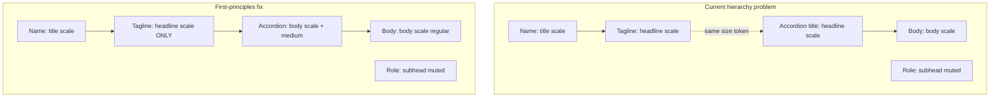

# Text Hierarchy Design Review (Apple HIG)

**Register:** brand (portfolio surface; typography *is* the hierarchy)  
**Scope:** Homepage, sub-pages (`/expression`, `/ondevice`), shared shell  
**Method:** Apple [Typography HIG](https://developer.apple.com/design/human-interface-guidelines/typography) + impeccable critique + first-principles redesign

---

## Design Health Score (typography focus)

| Area | Score | Notes |
|------|-------|-------|
| Semantic roles | 6/10 | Five size tokens exist, but weight/leading/color are applied ad hoc per component |
| Scale contrast | 5/10 | Only title→headline hits ~1.26×; lower steps are ~1.06–1.12× (impeccable recommends ≥1.25× between hierarchy levels) |
| Cross-breakpoint consistency | 4/10 | Mobile overrides collapse role into body size; duplicate `clamp()` on tagline vs accordion |
| Apple HIG alignment | 6/10 | Good: tinted neutrals, 400/500 weights, restrained palette. Weak: no true “headline = body size + emphasis” pattern |
| Accessibility semantics | 5/10 | Sub-pages drop `h1` for name; no `prefers-reduced-motion` concern here, but no response to user font-size preferences beyond `rem` |
| Documentation drift | 6/10 | [`DESIGN.md`](DESIGN.md) omits `--text-caption`; line-heights differ from code |

**Overall typography hierarchy: 5.5/10** — calm and on-brand, but levels are too close and role meaning is split across files.

---

## Apple HIG Principles (applied to this site)

Apple does not ask you to copy SF Pro point sizes. It asks for **semantic text styles** where hierarchy is conveyed through **size, weight, and color together**, and **relative order is preserved when text scales**.

| Apple semantic style | Intended role | Current site mapping |
|---------------------|---------------|---------------------|
| Title 2 / Title 3 | Page identity | `.home__name` → `--text-title` ✓ |
| Headline | Emphasized label, list-row title | `.home__line--tagline` AND `.home__project-title` → same token ✗ |
| Body | Multi-line reading text | `.home__project-body p` → `--text-body` ✓ |
| Subheadline | Secondary meta, role lines | `.home__line--role`, footer links → `--text-subhead` ✓ |
| Caption | Fine print | `.home__footer-meta` → `--text-caption` ✓ |

**Key HIG insight the site misses:** On iOS, **Headline and Body share the same point size** (17pt); Headline is Semibold, Body is Regular. Your accordion row titles use a *larger* size than body (`--text-headline`), which makes them **visual peers of the intro tagline** instead of scannable list labels.



---

## What is working

1. **Ink ladder matches Apple neutrals** — primary (`--ink`), secondary (`--color-body`), tertiary (`--text-muted`) in [`app/styles/tokens.css`](app/styles/tokens.css) mirrors SF label hierarchy.
2. **One family, two weights** — Satoshi 400/500 only; no light weights (HIG-approved).
3. **Measure constraints** — `--home-measure-narrow` (34ch) and `--home-measure-body` (50ch) keep line length readable; HIG-friendly.
4. **Footer tiering** — subhead links + caption meta is correct Apple caption/footnote placement.

---

## Priority issues

### P1 — Tagline and accordion titles compete (cross-column)

Both use `--text-headline` at weight 500 and `--text` color:

```118:125:app/styles/layout.css
.home__line--tagline {
  font-family: var(--font-medium);
  font-size: var(--text-headline);
  font-weight: 500;
  ...
}
```

```30:37:app/styles/accordion.css
.home__project-title {
  font-family: var(--font-medium);
  font-size: var(--text-headline);
  font-weight: 500;
  ...
}
```

On a 2-column desktop layout, the left intro punchline and right list titles read as **the same importance level**. Apple would reserve the larger/emphasized headline for the primary message; list rows would be **body-scale + medium weight**.

**Fix:** Accordion summaries adopt Apple Headline semantics (`--text-body` + `font-medium`). Keep `--text-headline` for intro tagline only.

---

### P2 — Mobile overrides collapse hierarchy

```313:318:app/styles/layout.css
  .home__line--role {
    font-size: var(--text-body);
  }
  .home__line--tagline {
    font-size: clamp(1.0625rem, 4.2vw, 1.1875rem);
  }
```

- Role jumps **up** to body size (loses subhead distinction).
- Tagline gets a **one-off clamp** instead of the shared token (accordion has a slightly different clamp in [`accordion.css`](app/styles/accordion.css) line 161).

HIG: *“Maintain the relative hierarchy when people adjust text sizes.”* These overrides break that on phone.

**Fix:** Delete mobile size overrides; let `--text-*` tokens handle fluid scaling. If phone needs more contrast, widen token min/max values once in `tokens.css`, not per-class.

---

### P3 — Type tokens are size-only; leading/tracking scattered

Line-heights today: 1.2 (name, links), 1.3 (accordion), 1.35 (tagline, footer meta), 1.47 (base), 1.55 (body). No `--leading-*` tokens.

Apple pairs each text style with designed leading and tracking. Your title/headline negative tracking is good; the rest is inconsistent.

**Fix:** Bundle each semantic style:

```css
/* tokens.css — illustrative */
--type-title-size: ...;
--type-title-leading: 1.2;
--type-title-tracking: -0.022em;

--type-headline-size: ...;  /* intro tagline only */
--type-headline-leading: 1.3;

--type-body-size: ...;
--type-body-leading: 1.55;  /* multi-line reading */

--type-subhead-size: ...;
--type-caption-size: ...;
```

Component CSS references bundles, not raw size + guessed leading.

---

### P4 — Scale steps too tight below title

At max viewport (with `html { font-size: 112.5% }`):

| Step | Ratio to previous |
|------|-------------------|
| title → headline | ~1.26× ✓ |
| headline → body | ~1.12× ✗ |
| body → subhead | ~1.06× ✗ |
| subhead → caption | ~1.07× ✗ |

The intro tagline does not feel clearly above body copy; role and education blur into footer subhead.

**Fix (restrained, on-brand):** After P1 (accordion → body scale), optionally bump tagline one step (toward Apple Title 3 ~20pt equivalent) OR increase subhead↔body separation by ~0.0625rem at the token level. Do not add new font sizes beyond the existing five tokens; **reassign roles** first, then tune token values once.

---

### P5 — Semantic HTML heading order

[`SiteShell.tsx`](components/SiteShell.tsx) uses `h1` on homepage but `p` on sub-pages (`nameAsHeading={false}`). Visual styles match; **document outline does not**.

**Fix:** Sub-pages: `h1` for site name (linked home), `h2` for page tagline (`.home__line--tagline`). Preserves one `h1` per page per WCAG/HIG.

---

### P6 — Pullquotes share body typography

Pullquotes use same size/weight as paragraphs; only a rose left border differentiates them. Apple **Callout** style is slightly distinct for quoted emphasis.

**Fix (optional, low risk):** `--text-subhead` size with body leading, or keep body size but medium weight for first line. **Keep the rose left border** — it is an explicit site convention in AGENTS.md (overrides impeccable side-stripe ban for this element).

---

## Minor observations

- `html { font-size: 112.5% }` inflates all `rem` tokens by 12.5%; document in [`DESIGN.md`](DESIGN.md) so token math is transparent.
- `.home__link` forces `font-medium` at body size even for header contact nav — correct for interactive emphasis.
- Education line reuses `--role` styling inside accordion column — good reuse, but after P2 fix ensure it stays visually below accordion titles.
- No automated typography assertions in tests; e2e checks copy, not computed styles.

---

## First-principles redesign (if we had built this on day one)

**Principle:** One semantic type system, three axes (size, weight, color), applied by **content role** not by **component class**.

### Proposed role map

| Role | Size token | Weight | Color | Used by |
|------|-----------|--------|-------|---------|
| `type-title` | `--text-title` | 500 | `--text` | Name in header |
| `type-headline` | `--text-headline` | 500 | `--text` | Intro tagline only |
| `type-body` | `--text-body` | 400 | `--color-body` | Dropdown paragraphs |
| `type-headline-inline` | `--text-body` | 500 | `--text` | Accordion summaries, inline links |
| `type-subhead` | `--text-subhead` | 400 | `--text-muted` | Role, education, updating note |
| `type-caption` | `--text-caption` | 400 | `--text-muted` | Footer meta |

### File changes (implementation phase)

1. [`app/styles/tokens.css`](app/styles/tokens.css) — add leading/tracking tokens per role; tune clamp values if needed after role reassignment.
2. [`app/styles/layout.css`](app/styles/layout.css) — tagline uses full `type-headline` bundle; remove mobile overrides; map `.home__line--role` to `type-subhead` bundle.
3. [`app/styles/accordion.css`](app/styles/accordion.css) — `.home__project-title` → `type-headline-inline` (body size + medium); remove mobile clamp override.
4. [`components/SiteShell.tsx`](components/SiteShell.tsx) + [`components/ProjectPage.tsx`](components/ProjectPage.tsx) — fix heading semantics (`h1`/`h2`).
5. [`DESIGN.md`](DESIGN.md) — document caption token, bundled styles, Apple role mapping, `112.5%` root note.
6. **Tests** — add one Vitest or Playwright check that computed `font-size` of tagline > accordion title > role (preserves hierarchy at desktop and mobile widths).

### Verification (execution phase)

- Run `npx impeccable --json components/` for markup anti-patterns.
- Browser pass at 390px, 768px, 1280px: snapshot intro column vs accordion column hierarchy.
- `npm test` + `e2e/home.spec.ts` unchanged copy assertions.
- Dark mode: confirm tertiary/secondary contrast still passes.

---

## Anti-patterns verdict

**Not AI slop.** No gradient text, card grids, or hero metrics. The risk is **flat Apple mimicry**: five nearly-equal steps that look “system-native” but fail to guide the eye. The fix is role discipline, not decoration.

---

## Recommended decision

**Ship the role reassignment (P1 + P2 + P3 + P5)** as one focused typography pass. **Defer P4 token tuning** until visual QA on phone confirms whether tagline needs a size bump after accordion titles move down.

This preserves extreme simplicity while making hierarchy behave like Apple semantic styles: one clear headline per view, list labels at body emphasis, meta consistently muted.
